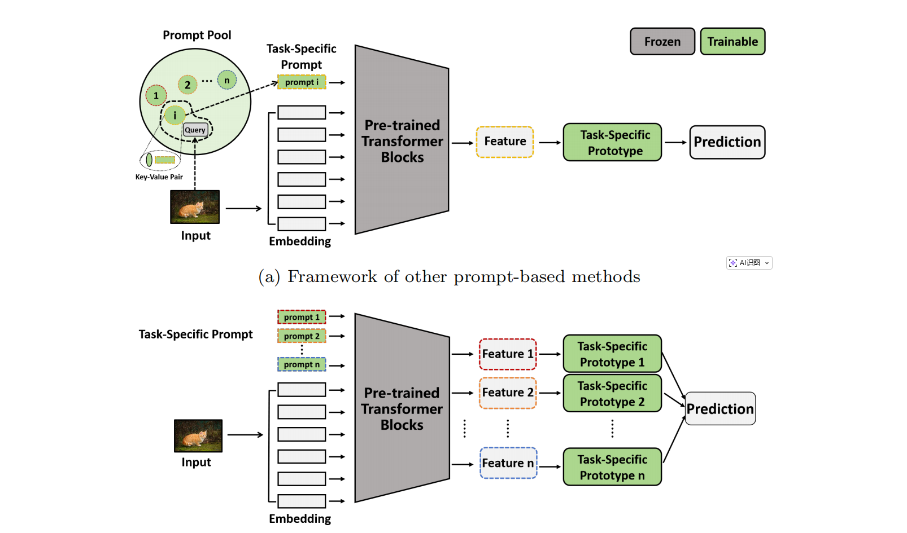
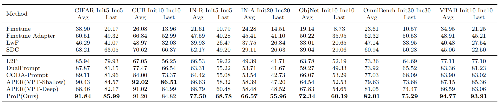

# Key-Value Pair-Free Prompt-Based Continual Learning via Task-Specific Prompt-Prototype

<div align="center">

<div>
    <a  target='_blank'>Hai-Hua Luo</a><sup>1,4</sup>&emsp;
    <a  target='_blank'>Xu-Ming Ran</a><sup>2</sup>&emsp;
    <a  target='_blank'>Zheng-ji Li</a><sup>4</sup>&emsp;
    <a  target='_blank'>Hui-yan Xue</a><sup>4</sup>&emsp;
    <a  target='_blank'>Jiang-Rong Shen </a><sup>3,5</sup>
    <a  target='_blank'>Tommi Kärkkäinen </a><sup>1</sup>
    <a  target='_blank'>Qi Xu </a><sup>4</sup>
    <a  target='_blank'>Feng-Yu Cong </a><sup>4</sup>
</div>
<div>
<sup>1</sup>University of Jyväskylä &emsp;
<sup>2</sup>National University of Singapore&emsp;
<sup>3</sup>Zhejiang University &emsp;
<sup>4</sup>Dalian University of Technology  &emsp;
<sup>5</sup>Xi’an Jiaotong University State Key  &emsp;
</div>
</div>

The code repository for "Key-Value Pair-Free Prompt-Based Continual Learning via Task-Specific Prompt-Prototype" 


## Key-Value Pair-Free Prompt-Based Continual Learning via Task-Specific Prompt-Prototype

## Introduction

Continual learning aims to enable models to acquire new knowledge while
retaining previously learned information. Prompt-based methods have shown
remarkable performance in this domain; however, they typically rely on
key-value pairing, which can introduce inter-task interference and hinder
scalability. To overcome these limitations, we propose a novel approach
employing task-specific Prompt-Prototype (ProP), thereby eliminating the
need for key-value pairs. In our method, task-specific prompts facilitate more
effective feature learning for the current task, while corresponding prototypes
capture the representative features of the input. During inference, predictions
are generated by binding each task-specific prompt with its associated prototype. 
Additionally, we introduce regularization constraints during prompt
initialization to penalize excessively large values, thereby enhancing stability.
Experiments on several widely used datasets demonstrate the effectiveness of
the proposed method. In contrast to mainstream prompt-based approaches,
our framework removes the dependency on key-value pairs, offering a fresh
perspective for future continual learning research.




## Results

We conducted experiments on seven benchmark datasets to verify the competitive performance of ProP.



## Requirements
### Environment
1. python 3.8.20
2. torch 2.0.1
3. torchvision 0.15.2
4. timm 0.6.12

### Dataset
We provide the processed datasets as follows:
- **CIFAR100**: will be automatically downloaded by the code.
- **CUB200**:  Google Drive: [link](https://drive.google.com/file/d/1XbUpnWpJPnItt5zQ6sHJnsjPncnNLvWb/view?usp=sharing) or Onedrive: [link](https://entuedu-my.sharepoint.com/:u:/g/personal/n2207876b_e_ntu_edu_sg/EVV4pT9VJ9pBrVs2x0lcwd0BlVQCtSrdbLVfhuajMry-lA?e=L6Wjsc)
- **ImageNet-R**: Google Drive: [link](https://drive.google.com/file/d/1SG4TbiL8_DooekztyCVK8mPmfhMo8fkR/view?usp=sharing) or Onedrive: [link](https://entuedu-my.sharepoint.com/:u:/g/personal/n2207876b_e_ntu_edu_sg/EU4jyLL29CtBsZkB6y-JSbgBzWF5YHhBAUz1Qw8qM2954A?e=hlWpNW)
- **ImageNet-A**: Google Drive: [link](https://drive.google.com/file/d/19l52ua_vvTtttgVRziCZJjal0TPE9f2p/view?usp=sharing) or Onedrive: [link](https://entuedu-my.sharepoint.com/:u:/g/personal/n2207876b_e_ntu_edu_sg/ERYi36eg9b1KkfEplgFTW3gBg1otwWwkQPSml0igWBC46A?e=NiTUkL)
- **OmniBenchmark**: Google Drive: [link](https://drive.google.com/file/d/1AbCP3zBMtv_TDXJypOCnOgX8hJmvJm3u/view?usp=sharing) or Onedrive: [link](https://entuedu-my.sharepoint.com/:u:/g/personal/n2207876b_e_ntu_edu_sg/EcoUATKl24JFo3jBMnTV2WcBwkuyBH0TmCAy6Lml1gOHJA?e=eCNcoA)
- **VTAB**: Google Drive: [link](https://drive.google.com/file/d/1xUiwlnx4k0oDhYi26KL5KwrCAya-mvJ_/view?usp=sharing) or Onedrive: [link](https://entuedu-my.sharepoint.com/:u:/g/personal/n2207876b_e_ntu_edu_sg/EQyTP1nOIH5PrfhXtpPgKQ8BlEFW2Erda1t7Kdi3Al-ePw?e=Yt4RnV)
- **ObjectNet**: Onedrive: [link](https://entuedu-my.sharepoint.com/:u:/g/personal/n2207876b_e_ntu_edu_sg/EZFv9uaaO1hBj7Y40KoCvYkBnuUZHnHnjMda6obiDpiIWw?e=4n8Kpy) You can also refer to the [filelist](https://drive.google.com/file/d/147Mta-HcENF6IhZ8dvPnZ93Romcie7T6/view?usp=sharing) if the file is too large to download.

You need to modify the path of the datasets in `./utils/data.py`  according to your own path.
These datasets are referenced in the [ADAM](https://github.com/zhoudw-zdw/RevisitingCIL) 

##  Running scripts

Follow the settings in the `exps` folder to prepare json files, and then run:

```
python main.py --config ./exps/[filename].json
```

**Here is an example of how to run the code** 

if you want to run the cifar dataset using ViT-B/16-IN1K, you can follow the script: 
```
python main.py --config ./exps/prop_cifar.json
```

if you want to run the cifar dataset using ViT-B/16-IN21K, you can follow the script: 
```
python main.py --config ./exps/prop_cifar_in21k.json
```

After running the code, you will get a log file in the `logs/prop/cifar224/` folder.

## Acknowledgment

We would like to express our gratitude to the following repositories for offering valuable components and functions that contributed to our work.

- [PILOT: A Pre-Trained Model-Based Continual Learning Toolbox](https://github.com/sun-hailong/LAMDA-PILOT)
- [RevisitingCIL](https://github.com/zhoudw-zdw/RevisitingCIL)
